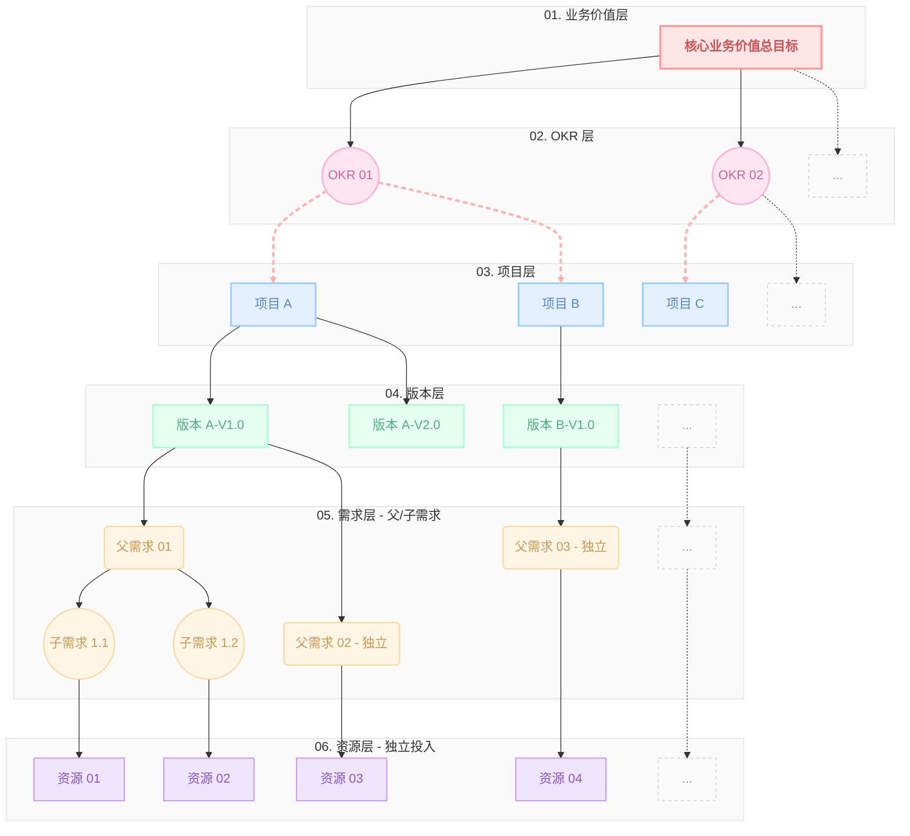
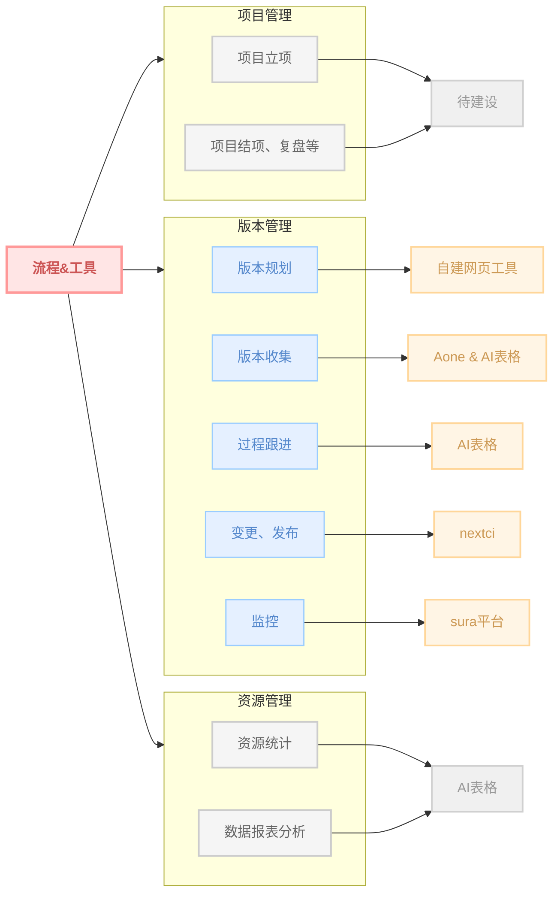
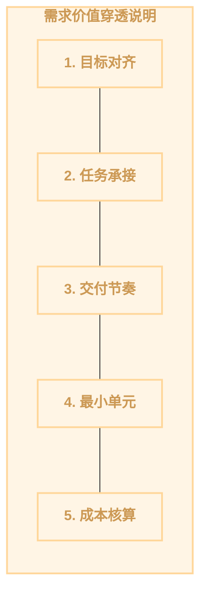

# 优化后的淡彩色系流程图

## 图1: 需求价值穿透层级图

---

## 图2: 流程与工具映射图

---

## 图3: 需求价值穿透说明

---

## 配色说明

### 淡彩色系调色板

| 层级 | 背景色 | 边框色 | 文字色 | 说明 |
|------|--------|--------|--------|------|
| 业务价值 | #FFE5E5 | #FF9999 | #CC5555 | 柔和珊瑚粉 |
| OKR层 | #FFE5F0 | #FFB3D9 | #CC6699 | 淡雅薰衣草粉 |
| 项目层 | #E5F0FF | #99CCFF | #5588CC | 轻盈天蓝 |
| 版本层 | #E5FFF0 | #99FFCC | #55AA88 | 温润薄荷绿 |
| 需求层 | #FFF5E5 | #FFD699 | #CC9955 | 温暖蜜桃橙 |
| 资源层 | #F0E5FF | #CC99FF | #8855CC | 柔和紫罗兰 |
| 待建设/缺失 | #F0F0F0 | #D0D0D0 | #999999 | 中性灰 |
| 建设中 | #FFF5E5 | #FFD699 | #CC9955 | 温暖蜜桃橙 |

### 设计特点

1. **低饱和度配色**: 所有颜色均采用低饱和度版本,避免视觉疲劳
2. **层次分明**: 通过色彩的微妙差异建立清晰的层级关系
3. **柔和对比**: 边框与背景保持适度对比,确保可读性
4. **统一风格**: 全图采用统一的淡彩色系,营造和谐视觉体验
5. **圆角优化**: 建议在使用时启用圆角效果(如果渲染器支持)
